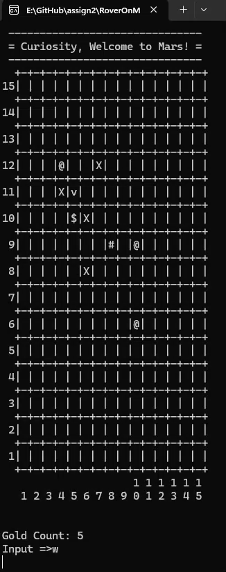

# rover-on-mars


**rover-on-mars** is a simple text-based exploration game originally developed as part of a programming fundamentals assignment.  

It simulates a rover navigating the Martian surface inside a command prompt environment.  

The project demonstrates early applications of **C++ programming**, including structured input handling, collision detection, and grid-based game logic.

<p align="center">
  
</p>

## ✨ Features

- Text-based game loop running entirely in the terminal  
- Rover movement with rotation and forward motion  
- Collision detection against map obstacles  
- Score collection mechanic with gold pickups  
- Simple win/lose conditions (collect vs. traps)  
- Easily extendable map system using ASCII symbols  

## Project Structure

```bash
rover-on-mars/
├── CMakeLists.txt         # CMake build configuration
├── generate.bat           # Generate solution
├── README.md              # This file
├── src/                   # Source code
└── generated-vs/          # Generated Visual Studio solution
```

## Project Setup

### Step 1: Generate Solution

Execute the generator script. This will install dependencies and generate the Visual Studio solution:

```cmd
/generate.bat
```

The solution will be generated in

```cmd
/generated-vs/
```

### Step 2: Build Solutions

Open the generated solution located at:

```cmd
/generated-vs/rover-on-mars.sln
```

> ⚠️ Ensure the start-up project is `rover-on-mars` during build or debug.

## Running Project 

### Game Controls

- `A` / `D` : Rotate the rover  
- `W` : Move forward  

### Map Symbols

- `X` : Trap — game over upon contact  
- `$` : Gold — increases score upon contact  
- `#` : Hill — blocks the rover from advancing  
- `@` : Unimplemented symbol (reserved by original author)  

## Acknowledgments
This project was originally created as a university programming fundamentals assignment.
It has been preserved and modernized here with CMake and CI integration, serving as an example of early-stage C++ learning, console-based gameplay, and project modernization practices.

Migrated from Visual Studio project files to CMake-based build system

- **Original Author (Assignment Owner):** [@Dylan55767](https://github.com/Dylan55767) *(account no longer accessible)*  
- **Modernization & Maintainer:** [@hchia93](https://github.com/hchia93)
